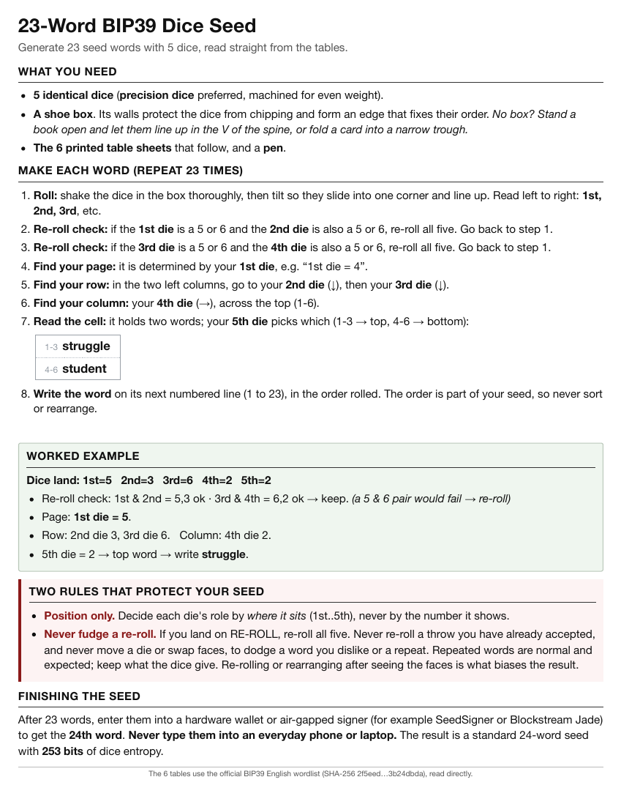
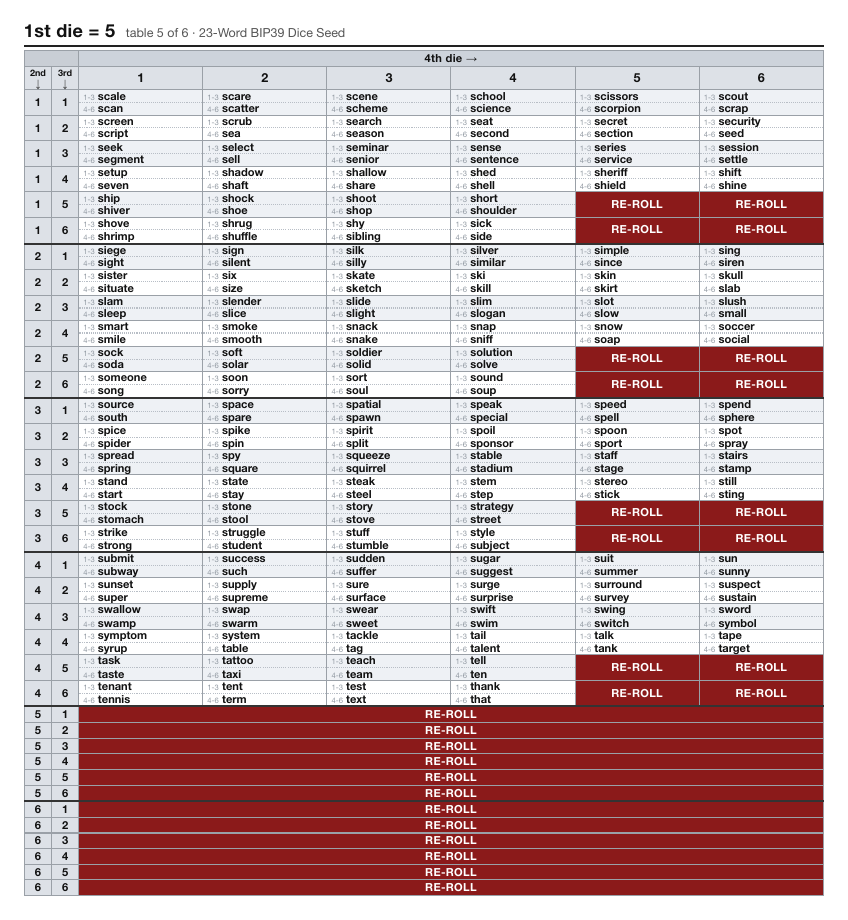

# BIP39 5-Dice Seed Tables

[](https://github.com/jsotelo/bip39-5-dice-seed/actions/workflows/ci.yml)

Roll five six-sided dice, read a BIP39 seed word straight off a printed table,
and repeat 23 times. The words are precomputed into the tables, so there is no
numbered wordlist to cross-reference and no arithmetic to do by hand. Only the
final checksum word needs a device, and it must be a hardware wallet or other
air-gapped machine, never your everyday phone or laptop.

|  |  |
|:---:|:---:|
| Page 1: the guide | Pages 2 to 7: the lookup tables |

## Quickstart

Print [`dice_tables.pdf`](dice_tables.pdf) on US Letter paper. Grab five matching
dice, a shoe box, and a pen. Ordinary dice work, but **precision dice** (sold as
casino dice) are worth it, because the seed is only as fair as the dice that
make it. Then, for each of the 23 words:

1. **Roll.** Shake all five dice in the box, then tilt it so they slide into a
   corner and line up. Read them left to right as 1st through 5th.
2. **Check for a re-roll.** If the 1st and 2nd dice are both 5 or 6, re-roll all
   five. Same if the 3rd and 4th dice are both 5 or 6.
3. **Look up the cell.** The 1st die picks the page, the 2nd and 3rd dice pick
   the row, the 4th die picks the column. The cell holds two words, and the 5th
   die picks which one: 1 to 3 is the top word, 4 to 6 is the bottom.
4. **Write it down** on the next numbered line. The order is part of the seed,
   so never sort or rearrange the list.

Then enter the 23 words into a hardware wallet or other air-gapped device, for
example SeedSigner or Blockstream Jade, to get the 24th (checksum) word. Do not
type them into an everyday phone or laptop, even offline. A machine that has
ever been online, or ever will be, is not a safe place for a seed.

## Two rules that protect your seed

- **Position, not faces.** A die's role comes from where it sits in the row (1st
  through 5th), never from the number it shows.
- **Never fudge a throw.** Re-roll all five dice when the tables say RE-ROLL, and
  never touch a throw you have already accepted. Do not re-roll or rearrange
  dice to dodge a word you dislike or a repeat. Repeated words are normal.
  Changing anything after seeing the faces is what biases the result.

## Why trust it

An independent audit script re-derives the mapping from scratch, parses the
generated document, and cross-checks every one of the 1296 table positions
against the BIP39 wordlist. It never imports the generator, so a bug in the
generator cannot hide from it. It needs Python 3.10 or newer and nothing else,
not even this project's build dependencies:

```
python3 audit_dice_tables.py
```

A clean run ends with `AUDIT RESULT: PASS`. Note that macOS still ships Python
3.9 as `/usr/bin/python3`, so you may need a newer interpreter.

## Documentation

| Document | Read it if you want |
|---|---|
| [How it works](docs/how-it-works.md) | The math: rejection sampling, the index formula, and why the RE-ROLL cells are scattered across the page. |
| [Security model](docs/security.md) | The entropy accounting, what the design guarantees, and what it does not. |
| [Build and verify](docs/build-and-verify.md) | To regenerate the document yourself, print it, or run the audit and tests. |

## Credits

Adapted from [scottmsul/DiceTables](https://github.com/scottmsul/DiceTables),
which uses a d4 and three d8. This version is reworked for five identical
six-sided dice, using rejection sampling to handle die faces that are not a
power of two.

MIT licensed, see [LICENSE](LICENSE). Provided without warranty, and you are
responsible for verifying it yourself and for securing the resulting seed. See
the [security model](docs/security.md) for the full disclaimer.
